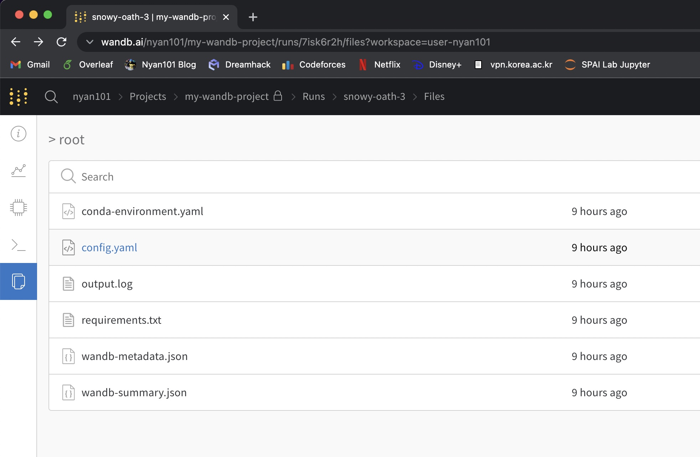

## 학습 진행상황 기록하기

[이전 글](https://nyan101.github.io/blog/notes-on-pytorch-04)에서 작성한 코드는 `tqdm` 라이브러리를 통해 "학습이 얼마나 진행되었는가"를 실시간으로 출력했다. 이를 통해 실행이 끝나기까지 막연히 기다리기만 하는 일반적인 코드와는 달리, 각 epoch당 남은 예상시간과 epoch별 train/val loss, accuracy를 출력해 학습이 진행됨에 따라 정확도가 높아지는 모습을 로그로 남길 수 있었다.

지난번 코드의 출력 일부를 아래에 옮겼다.

```
Using device: cuda
-----------------
> Epoch 1/5
100%|██████████| 200/200 [00:05<00:00, 34.14it/s]
val Loss: 2.3033  Acc: 0.1043 (1043/10000)
-----------------
> Epoch 2/5
100%|██████████| 800/800 [00:59<00:00, 13.52it/s]
train Loss: 1.4675  Acc: 0.4736 (18944/40000)
100%|██████████| 200/200 [00:04<00:00, 42.41it/s]
val Loss: 1.2823  Acc: 0.5465 (5465/10000)
-----------------
> Epoch 3/5
100%|██████████| 800/800 [00:59<00:00, 13.53it/s]
train Loss: 1.0625  Acc: 0.6243 (24970/40000)
100%|██████████| 200/200 [00:04<00:00, 42.35it/s]
val Loss: 1.1661  Acc: 0.5980 (5980/10000)
...
```

그런데 단순히 텍스트만 출력하지 않고, 학습 진행상황에 따른 지표를 그래프로 보고 싶다면 어떻게 해야 할까? 각 step별 loss, acc값을 리스트에 저장하고 `matplotlib`를 사용하는 것도 한 가지 방법이다. 그러나 이런 방법은 학습이 다 끝난 후에야 결과를 확인할 수 있고, 매 학습에서의 결과를 통합해 관리하기 어렵다는 단점이 있다. 이번 글에서는 `wandb`를 통해 모델의 학습 진행상황을 추적하고 이를 관리하는 법에 대해 알아보자.


### wandb란 무엇인가 & 가입 및 초기 설정

wandb는 ~~Wan DB가 아니라~~ Weight & Bias의 약자로, 모델의 학습 진행상황을 추적하고 자동화된 파라미터 튜닝을 지원하는 웹 도구이다. 공식 홈페이지(https://wandb.ai/)에서 github나 gmail 계정을 이용해 쉽게 가입이 가능하며, 처음 로그인하면  다음과 같은 화면을 볼 수 있다.


터미널에서 다음 명령어를 통해 wandb를 설치하고 웹에 표시된 API Key를 입력하자.

```
pip install wandb
wandb login
```

이제 파이썬에서 wandb를 사용할 수 있다.


### wandb를 이용해 학습 진행상황 로깅하기

wandb의 주요 기능은 다음과 같다.

* 진행상황 추적을 위한 세션 관리(Worksplace, Table)
  * 매 실험(run)마다 사용했던 설정값(config) 기록
  * 실험이 진행되는 동안 주요 값(loss, acc 등) 추적
  * 실험이 진행되는 동안 CPU, GPU, 메모리 사용량 등 추적
  * 실험이 진행되는 동안 모델 파라미터들의 그래디언트, 파라미터값 추적
* 보고서 관리(Reports)
* 자동화된 하이퍼파라미터 튜닝(Sweeps)
* 모델 버전 관리(Artifacts)

여기서는 wandb의 로깅 기능에 집중하자. 앞서 wandb를 설치하고 API Key를 입력했다면 아래와 같은 코드를 통해 wandb 세션(run)을 시작할 수 있다.

```python
import wandb

config = {
    'batch_size' : 32,
    'epoch' : 4,
    'some-other-config' : "you can put any value here"
    ...
}

wandb.init(project='my-wandb-project', name='run-1', config=config, save_code=False)
```

`wandb.init()`에서의 주요 파라미터는 다음과 같다.

* `project` : 프로젝트명. 웹에서 "Create new project"로 생성한 프로젝트명을 사용하거나 새로운 이름을 사용할 수 있다. 존재하지 않는 프로젝트명을 입력하면 자동으로 해당 이름을 가진 새로운 프로젝트가 생성된다.
* `name` : 세션의 이름. 입력하지 않으면 자동으로 랜덤한 이름이 배정된다.
* `config` : 세션에서 사용한 주요 설정값. key-value 형태의 dictionary로 전달한다.
* `save_code` : True인 경우 해당 세션을 수행한 코드를 함께 저장한다.


세션이 활성화되면 `wandb.log()`를 통해 해당 세션에서 주요 값들을 추적할 수 있다.

```python
wandb.log({'var1' : value, 'var2' : value2})
```

값 기록은 위와 같은 dictionary 형태로 이루어지며, wandb.log()를 호출할 때마다 동일한 키에 대한 값들이 누적되어 기록된다. 단순 스칼라(scalar) 값 외에도 히스토그램, 산포도와 같은 차트를 비롯해 이미지, 사운드, 비디오 등 다양한 형태를 기록할 수 있다.([참조](https://docs.wandb.ai/guides/track/log/media))

기록이 모두 끝나면 `wandb.finish()`를 통해 현재 활성화된 세션을 종료할 수 있다.


### train_model() 함수에 wandb 코드 추가하기

이제 [이전 글](https://nyan101.github.io/blog/notes-on-pytorch-04)에서 작성했던 `train_model()` 함수에 wandb와 연동하는 코드를 추가해보자. 기존 코드에서 추가된 부분을 주석으로 강조했다.

```python
def train_model(net, criterion, optimizer, dataloaders_dict, num_epochs, model_name=''):
    device = 'cuda' if torch.cuda.is_available() else 'cpu'
    net.to(device)
    print(f"Using device: {device}")
    
    ### config값을 저장한 dict 생성 ###
    config = {
        'model_name' : model_name,
        'batch_size' : dataloaders_dict['train'].batch_size,
        'epoch' : num_epochs,
        'criterion' : criterion,
        'optimizer' : optimizer,
        'some-other-config' : 'you can put any value here'
    }
    ### 새 wandb 세션 시작 ###
    wandb.init(reinit=True, project='first-wandb-project', config=config)
    ### 모델 추적을 위한 .watch 호출 ###
    wandb.watch(net)
    
    for epoch in range(num_epochs):
        print("-----------------")
        print(f"> Epoch {epoch+1}/{num_epochs}")
        for phase in ['train', 'val']:
            torch.set_grad_enabled(phase == 'train')
            if phase == 'train':
                net.train()
            else:
                net.eval()
            if (epoch == 0) and (phase == 'train'):
                continue
            epoch_loss = 0.0
            epoch_corrects = 0
            for x,y in tqdm(dataloaders_dict[phase]):
                x, y = x.to(device), y.to(device)
                output =  net(x)
                loss = criterion(output, y)
                if phase == 'train':
                    optimizer.zero_grad()
                    loss.backward()
                    optimizer.step()
                _, y_pred = torch.max(output, 1)
                epoch_loss += loss.item() * x.size(0)
                epoch_corrects += torch.sum(y_pred == y.data)
                ### train phase 한정으로 각 batch마다 loss를 기록 ###
                if phase == 'train':
                    wandb.log({'train_loss' : loss})
            epoch_loss = epoch_loss / len(dataloaders_dict[phase].dataset)
            epoch_acc = epoch_corrects.double() / len(dataloaders_dict[phase].dataset)
            ### 각 epoch마다 해당 phase에서의 loss, acc을 기록 ###
            wandb.log({f'{phase}_epoch_loss' : epoch_loss, f'{phase}_epoch_acc' : epoch_acc})
            print(f"{phase} Loss: {epoch_loss:.4f}  Acc: {epoch_acc:.4f} ({epoch_corrects}/{len(dataloaders_dict[phase].dataset)})")
    ### 학습이 끝난 후 세션 종료를 위한 .finish() 호출 ###
    wandb.finish()
```

이제 다양한 상황에서 위 train_model() 함수를 호출해보자. 코드를 단순화하기 위해 하이퍼파라미터를 튜닝하는 대신 서로 다른 모델을 불러와 학습하는 것으로 대체했다.

```python
# resnet18로 학습 진행
net = models.resnet18()
net.fc = nn.Linear(in_features=net.fc.in_features, out_features=10)
criterion = nn.CrossEntropyLoss()
optimizer = optim.Adam(params = net.parameters())

train_model(net, criterion, optimizer, dataloaders_dict, num_epochs=4, model_name='resnet18')

# resnet34로 학습 진행
net = models.resnet34()
net.fc = nn.Linear(in_features=net.fc.in_features, out_features=10)
criterion = nn.CrossEntropyLoss()
optimizer = optim.Adam(params = net.parameters())

train_model(net, criterion, optimizer, dataloaders_dict, num_epochs=4, model_name='resnet34')

# vgg16으로 학습 진행
net = models.vgg16(pretrained=True)
net.classifier[6] = nn.Linear(in_features=net.classifier[6].in_features, out_features=10)
criterion = nn.CrossEntropyLoss()
optimizer = optim.Adam(params = net.parameters())

train_model(net, criterion, optimizer, dataloaders_dict, num_epochs=4, model_name='vgg16(pretrained)')
```

코드를 실행하고 출력을 보면 매 train_model() 호출마다[^1] 새로운 wandb 세션이 만들어지는 것을 볼 수 있다.

[^1]: 정확히는 wandb.init() 호출마다


#### 웹에서 wandb 결과 확인하기

위 코드를 보면 각 batch마다 loss를, 각 epoch/phase마다 loss, acc을 기록하는 것을 볼 수 있다. 웹브라우저를 열어 wandb에 접속하면 학습이 진행됨에 따라 대시보드에 실시간으로 차트가 그려진다.


별다른 설정을 하지 않았다면 `wandb.log()` 를 통해 기록된 값들이 각 세션별 plot으로 그려지며, 그 외에 이미지, 사운드와 같은 미디어의 경우 별도의 적절한 형태로 표시된다.

왼쪽 목록에서 세션 이름을 클릭하면 세부 정보를 확인할 수 있다. 각 탭에서 볼 수 있는 정보에 대해 알아보자.

Overview 탭에서는 해당 세션이 실행된 환경의 기본적인 정보와 함께, `wandb.init()`에서 config에 넘겨줬던 값들을 확인할 수 있다.


---

Charts 탭에서는 해당 세션에서 `wandb.log()`로 기록했던 값들을 확인할 수 있다.


System 탭에서는 해당 세션이 실행되는 동안의 CPU, GPU, 메모리 사용량 등을 확인할 수 있다.


Logs 탭에서는 해당 세션이 실행되는 동안 `print()`를 통해 콘솔에 출력된 값을 그대로 확인할 수 있다.


Files 탭에서는 해당 세션과 관련된 메타데이터 파일을 볼 수 있다. 기본적으로 환경 정보, 패키지 정보, 로그파일 등이 저장되며, `wandb.init(save_code=True)`인 경우 소스파일이 함께 저장된다.




이외에도 wandb에서는 "학습이 끝나면 메일/슬랙으로 알림 보내기", "팀원들 간 공유 프로젝트 만들기" 등 생산성 향상을 위한 다양한 기능을 제공한다.

---