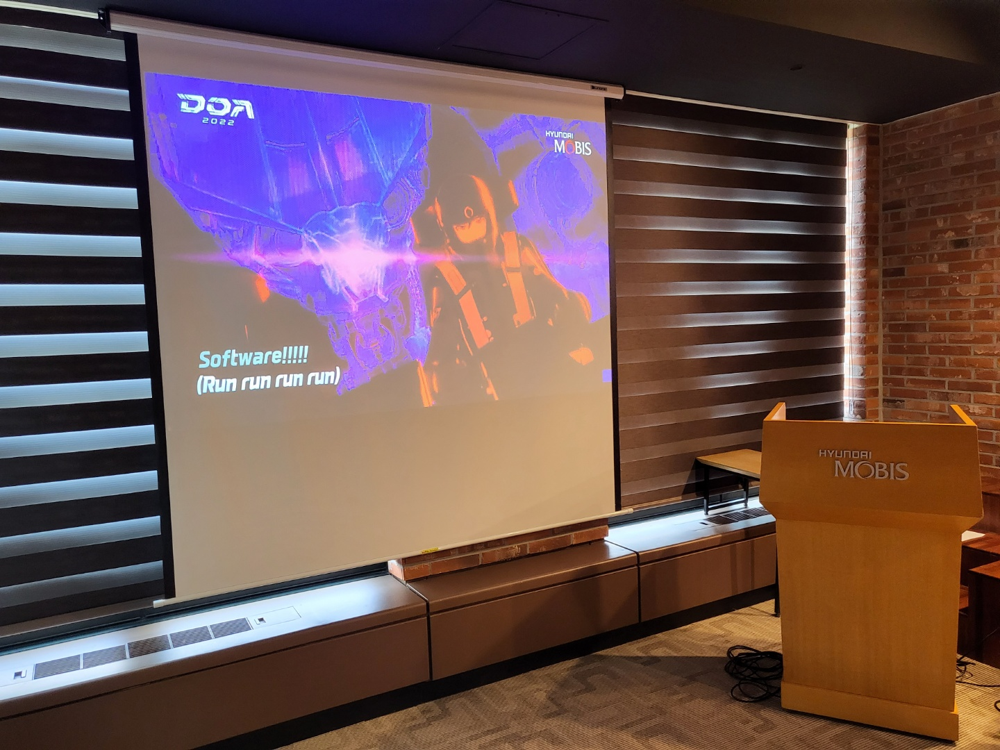
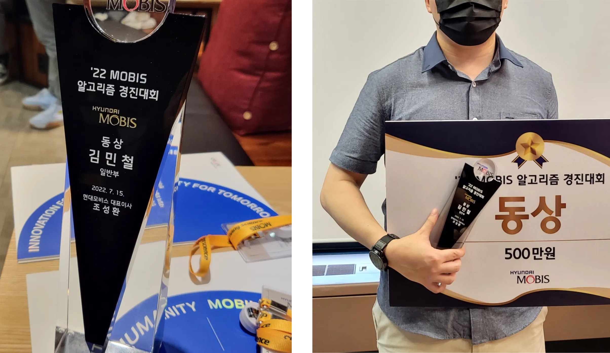

**TL;DR : 상금 500만원 감사합니다 >_<**

[작년](https://nyan101.github.io/blog/PS-contests-in-2021-review)에 이어 올해도 현대모비스에서 알고리즘 경진대회를 개최했다. 

이번에도 1등상품으로 **최신형 자동차**를 내걸었다는 상징성으로 인해 온라인에서 화제가 됐다. 올해는 작년과는 다르게 학생부 / 일반부를 분리해 운영했는데, 직업적인 특성(...)으로 인해 다소 애매한 포지션이었던 관계로 주최측 문의 후 안내에 따라 일반부로 지원했다.

### 예선

작년과 올해 대회를 모두 참가해본 입장에서 꽤 많은 부분이 바뀐 것을 느낄 수 있었다. 대표적인 것들을 뽑아보면 다음과 같다.

* 작년(2021)
  * 프로그래머스 플랫폼 사용
  * 모든 테스트케이스에 대한 정답 여부 공개
  * 실시간 스코어보드 제공

* 올해(2022)
  * 구름 플랫폼 사용
  * 정답 여부 비공개(본선에서는 일부 정보 공개)
  * 스코어보드 미제공

정답 여부가 비공개라는 점으로 인해 답안을 제출한 이후에도 "과연 제대로 푼 게 맞나"라는 의혹을 떨치기 힘들었고, 그렇게 스스로에 대한 믿음과 의심(?) 속에서 대회를 진행했다. 1~4번 문제를 해결한 후 마지막 문제를 고민했지만 정해가 떠오르지 않았고, 결국 고민 끝에 정해를 찾는 대신 나름대로의 휴리스틱 알고리즘을 설계해 구현했다. 

대회종료 후 결과를 보니 생각했던 휴리스틱이 나름 잘 작동한 것 같아 만족스러웠지만 당연히(?) 맞았다고 생각했던 2번 문제에서 66/150이라는 낮은 점수를 받았다. 후문에 따르면 구름 플랫폼의 스택 메모리 제한이 생각보다 적었고, 이로 인해 재귀함수의 호출 깊이에 한계가 존재했다고 한다(...)

그렇게 예선 4등으로 본선에 진출했다. 사실 처음엔 4등~30등까지 제공되는 아이패드 에어를 보고 참가했지만 막상 이렇게 되니 _"이거 잘하면 3등 안에 들 수도 있겠는데?"_ 라는 생각이 피어올랐다.

### 본선

~~예선에서 수많은 참가자들의 항의 끝에~~ 본선에서는 예선에 비해 일부 규칙이 바뀌었다.

* 모든 테스트케이스를 통과한 경우 정답임을 알려주었다
* 각 테스트케이스에 대해 수행시간 / 사용 메모리를 알려주었다

정답인 경우 확실히 정답임을 알려준다는 점에 힘입어 예선에서 겪었던 많은 부담감이 사라졌고, 한결 편한 마음으로 참가할 수 있었다. 다만 대회를 진행하는 도중 3번 문제의 지문이 다소 모호하게 서술되었는데, 문장의 해석에 대한 모든 질문에 _"대회의 공정성을 해칠 수 있어 답변하지 않는다"_ 라는 기계적인 답변만이 돌아온 것은 다소 아쉽게 느껴졌다. 풀이에 대한 힌트가 아닌 문제 자체의 조건을 이해하는 데 있어서의 안내는 전체공지 등을 통해 가능하지 않을까라는 생각이었지만, 결국 대회 도중에는 이에 대한 추가적인 답변을 받지 못한 상태에서 본선이 종료되었다.

예상했던 대로 3번 컨셉카 전시 문제에서 그렇게 높은 점수를 받지는 못했지만 4번에서 생각보다 높은 점수를 받았기에 약간의 기대를 가지고 최종 순위가 공개되기를 기다렸다.

본선이 끝난 다음주 월요일 순위가 공개되었고, 일반부 최종 3등이라는 결과를 얻었다. 원래 예상했던 아이패드에 비해 무척 높은 액수의 상금도 받고, 별도 시상식에도 초대되는 등 높은 성취긴 하지만 ~~사람 마음이라는게 워낙 간사해서~~ _"만일 3번 문제에서 조금만 더 높은 점수를 받았더라면 상금이 2배인데"_ 라는 약간의 아쉬움이 함께하는 결과였다.

### 시상식

그렇게 역삼역 현대모비스 본사에서 열리는 시상식에 초대되었다. 학생부 / 일반부 각 1~3등까지 총 6명의 수상자와 대회 운영진 분들이 함께했다.

~~예상을 안 헀던 건 아니지만~~ 대부분이 다른 대회들에서 자주 봐 친숙했던 분들이었고, 오랜만에 만나 안부를 전할 수 있었다.

상금에서 기타소득세 4.4%가 공제된 478만원이 입금된다는 안내와 함께 기념 상패를 받았다.

---