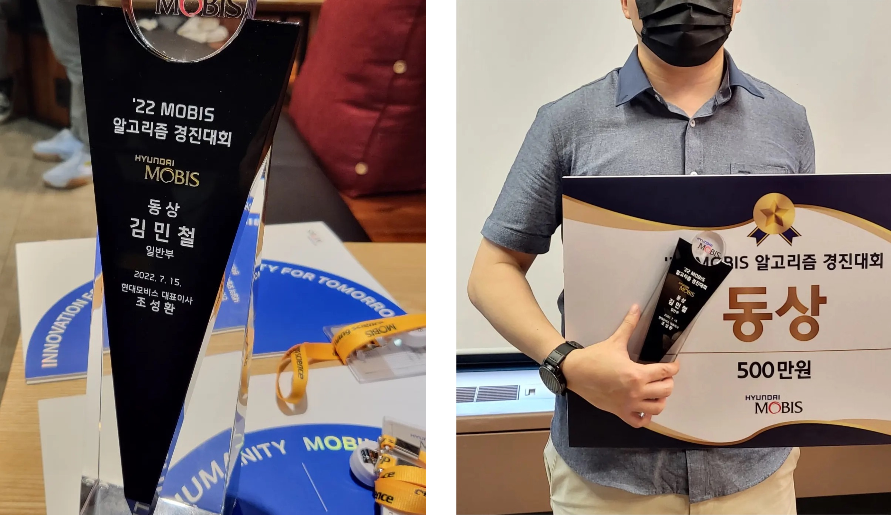

[2022년도 대회 후기 - 해킹(CTF) 편](https://nyan101.github.io/blog/CTF-contests-in-2022-review)에 이은 알고리즘(PS) 편이다. ~~어떻게 2023년 오기 전에 다 쓰기는 하네~~ 현대모비스 대회에서 예상치 못한 소득(feat. 500만원)과 함께 공군해커톤 등 나름 성과가 있었고, 올해도 SCPC 성불은 하지 못했다(...)

예선/본선 일자가 명확했던 CTF와 달리 이번에는 기간을 두고 진행한 온라인 대회들이 많아 일시는 생략했다.

## 구글 코드잼(Google Code Jam)

*"이제 코드잼 티셔츠만 4장(2019, 2020, 2021, 2022)이 되었습니다"*

* 주최/주관 : 구글(Google)
* 결과 : Round 3 진출

매년 구글에서 진행하는 프로그래밍 대회이다. Qualification Round → Round 1 → Round 2 → Round 3 → World Final까지 총 5단계로 이뤄지며, 각 라운드의 진출요건은 다음과 같다.
* Qualification Round
   * 절대평가로 30점 이상의 점수를 얻으면 Round 1로 진출
   * 결과 : **71/100**으로 Round 1 진출
* Round 1
   * 3개의 라운드(1A, 1B, 1C) 중 하나에서 1500위 이상을 달성하면 Round 2로 진출
   * 결과 : Round 1A에서 **357위**로 Round 2 진출
* Round 2
  * Round 2 참가자들 중 상위 1000명이 Round 3에 진출
  * 결과 : **502위**로 Round 3 진출
* Round 3
  * Round 3 참가자들 중 상위 25명이 World Final에 진출
  * **Round 3 진출자 전원에게 코드잼 티셔츠 증정**
  * 결과 : 최종 **459위**로 종료
* World Final
   * ~~여긴 논외로 치자~~

실력 유지를 위한 암묵적인 선으로 Round 3 상위 500명 이내를 목표로 잡았는데, [2019년](https://nyan101.github.io/blog/Google-CodeJam-2019-review), [2020년](https://nyan101.github.io/blog/Google-CodeJam-2020-review), [2021년](https://nyan101.github.io/blog/PS-contests-in-2021-review)에 이어 올해도 목표를 달성해 새 티셔츠를 얻을 수 있었다.

## ~~페이스북~~메타 해커컵(Meta Hacker Cup)

*"이상하게 해커컵 티셔츠랑은 연이 안 이어지네요..."*

* 주최/주관 : ~~페이스북(Facebook)~~ 메타(Meta)
* 결과 : Round 2 진출 ~~이번에도 티셔츠는 못 받았다~~

이제 주관사 명칭이 바뀐(?) 프로그래밍 대회이다. 코드잼과 유사하게 Qualification Round에서 World Final까지 총 5단계로 이뤄지며, 각 라운드의 진출요건은 다음과 같다.

* Qualification Round
  * 절대평가로 1문제 이상을 해결하면 Round 1로 진출
  * 결과 : **50/100**으로 Round 1 진출
* Round 1
  * 절대평가로 24점 이상의 점수를 얻으면 Round 2로 진출
  * 결과 : **40/100**으로 Round 1 진출
* Round 2
  * Round 2 참가자들 중 상위 500명이 Round 3에 진출
  * **1문제 이상을 해결한 상위 2000명의 참가자들에게 티셔츠 제공**
  * 결과 : **2817위**로 마감
* Round 3
  * Round 3 참가자들 중 상위 25명이 World Final에 진출
* World Final
  * 코드잼과 동일

작년에는 자느라 못 했지만 이번에는 티셔츠를 받겠다는 마음으로 졸린 몸을 이끌었다. 어떻게 한문제만 풀면 티셔츠를 받을 수 있겠다는 계산에 A번 문제를 풀고 다시 잠들었고, 대회 종료 후 결과를 보니 Small만 통과하고 Large 케이스에서 오답 판정이 나왔다(...) 공식 풀이와 모든 면에서 동일했지만 해시함수를 만들기 귀찮은 나머지 삼각함수($sin(x)$)를 이용해 간단히 만들었는데, 작은 값에서 가까운 $sin(x)$ 값들끼리 서로 유사한 결과를 내게 되면서 해시 충돌이 발생했던 것이다. 커스텀 해시함수 부분만 고치면 바로 정답이 되는 코드여서 더 아쉬웠다. ~~코드잼 티셔츠는 많은데 왜 해커컵은...~~

## MOBIS 알고리즘 경진대회

*"더이상 MOBIS 대회는 못 나가는 몸이 되었습니다"*

* 주최/주관 : 현대모비스
* 결과 : 동상(3위)

현대모비스에서 개최한 알고리즘 경진대회로, 운이 좋았는지 **500만원**이라는 상금을 획득할 수 있었다.

이건 시상식 직후에 [별도의 글](https://nyan101.github.io/blog/mobis-algorithm-contest-2022-review)을 작성한 적이 있어, 여기서는 자세한 설명을 생략한다. 이때 받은 상금으로 아이패드 프로를 사서 잘 쓰고있다.

\+ 올해부터 3등 이내 수상자는 차후 대회에 출전하지 못 하도록 제약이 생겨 이제 모비스 대회는 더이상 못 나간다(...)

## 군장병 코딩경진대회

*"어쩌다보니 맥북 프로, 아이패드 프로, 에어팟 프로를 모두 대회로 마련하게 된..."*

* 주최/주관 : 국방부, 국방오픈소스아카데미
* 결과 : 3위

매년 국방오픈소스아카데미에서 진행하는 <군장병 공개 SW 해커톤> 대회의 선발과정으로 이뤄지는 코딩경진대회이다. 다른 알고리즘 대회와 유사하게 문제풀이 방식으로 구성되었으며 프로그래머스 플랫폼을 통해 진행되었다.

앞 3개는 비교적 평이한 코딩테스트 문제들이었는데 마지막 문제에서 SOS(Sum of Subsets) DP를 이용해야 하는 문제가 나왔다. "이런 게 나온다고??" 라는 생각과 함께 겨우 시간 내에 해결해 제출했고, 그렇게 모든 문제를 풀어 400점 만점을 받았다. 전체 참가자들 중 만점자는 3명뿐이었지만 아쉽게도 제출시간의 차이로 인해 3등상(에어팟 프로)을 받았다. 이미 버즈 라이브를 잘 쓰고있어 에어팟은 당근마켓으로 보내졌다.

## 공군 해커톤

*"함께한 후임들에게 이 모든 영광을 돌립니다"*

* 주최/주관 : 공군본부
* 결과 : 장려상

공군본부에서 주관하는 아이디어 경연대회이다. 실제 코딩을 진행하지는 않고 아이디어를 제안하고 기획서와 발표를 통해 수상팀을 결정한다. 사실 작년에도 나갔었는데 예선부터 떨어져서 작년 후기에는 포함을 안 시켰다.

올해는 같은 부대에서 근무하는 후임들과 3인 팀을 이뤄 참가했다. 작년의 탈락을 거울삼아 좀더 신경써서 기획서를 작성했고, 팀원들이 애써준 덕인지 작년과는 달리 본선까지 진출해 최종 수상을 할 수 있었다.

## 삼성 대학(원)생 프로그래밍 경진대회(SCPC)

*"이거 점점 어려워지는데(...)"*

* 주관 : 삼성전자
* 결과 : 본선 진출

재작년, 작년에 이어 올해도 1,2차 예선, 본선 모두 온라인으로 진행되었다. 결과만 먼저 밝히면 올해도 본선은 나갔지만 성불(수상)은 하지 못했다(...) 문제가 점점 어려워지는 느낌인데 2023년에는 수상해서 성불하길...

---

