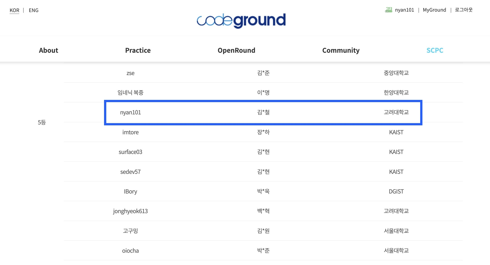

2023년 올해도 [CTF 편](https://nyan101.github.io/blog/CTF-contests-in-2023-review)에 이은 알고리즘(PS) 편이다. 올해는 ~~페이스북~~ 메타 해커컵 티셔츠, SCPC 성불 모두 이룬 나름 의미있는 해였다.

## 구글 코드잼(Google Code Jam)

*"이제는 역사의 흔적이 되어버린..."*

* 주최/주관 : 구글(Google)
* 결과 : ~~운영 종료~~

매년 구글에서 진행~~하는~~했던 프로그래밍 대회이다. [지난 글](https://nyan101.github.io/blog/farewell-codejam)에서 썼듯이, 올해부터는 더 이상 열리지 않는다.

## 메타 해커컵(Meta Hacker Cup)

*"올해 티셔츠는 구글 대신 메타에서 받았습니다"*

* 주최/주관 : 메타(Meta)
* 결과 : **Round 2 진출 + 티셔츠 획득**

페이스북 운영사인 메타(Meta)에서 주관하는 프로그래밍 대회이다. Round 1에서 World Final까지 총 5단계로 이뤄지며, 각 라운드의 진출요건은 다음과 같다.

* Practice Round
  * 이전 Qualification Round와 달리, 대회에 영향을 주지 않는 연습 라운드이다.
  * 결과 : 미참가
* Round 1
  * 절대평가로 ~~일정 점수 이상을 해결하면 Round 1로 진출~~ 1문제 이상을 해결하면 Round 1 진출[^1]
  * 결과 : **44/100**으로 Round 2 진출
* Round 2
  * Round 2 참가자들 중 상위 500명이 Round 3에 진출
  * **1문제 이상을 해결한 상위 2000명의 참가자들에게 티셔츠 제공**
  * 결과 : **768위**로 마감
* Round 3
  * Round 3 참가자들 중 상위 25명이 World Final에 진출
* World Final
  * 천상계(...)

[^1]: Round 1 진행 중, 서버 오류가 생기면서 양수 점수를 얻은 사람 모두를 Round 2로 진출시켰다(...)

올해는 코드잼도 없어 이번에야말로 해커컵 티셔츠를 받겠다는 마음으로 대회에 참가했다. Round 1 진행 중 갑자기 답안 제출이 안 되는 문제가 발생했고, 빠르게 SNS를 열어보니 나뿐만이 아닌 많은 사람들이 동일한 문제를 겪고있다는 걸 확인할 수 있었다. 한밤중이었던 만큼 *"서버 오류면 다음에 다시 하던지 따로 공지를 올려주겠지"*라는 생각으로 자러 들어갔고, 결과적으로 한 문제 이상 푼 사람 모두를 Round 2로 진출시키겠다는 공지가 올라왔다.

그렇게 Round 2 대회날이 다가왔고, ~~나와 해커컵 사이의 유구한 역사에 따라~~ 올해도 다른 일정과 겹쳤다(...) 데이트 약속이 있던 날로, 데이트가 끝난 후 들고 간 노트북을 이용해 대회에 참여했다. 대회를 진행하면서 "좀더 해서 Round 3 진출을 노려볼까..." 라는 생각도 들었으나, 피로가 누적된 몸은 *"World Final이 아니면 어차피 티셔츠 하나 받는 건 똑같지 않나?"*라는 마음속 속삭임과 타협해 적당한 선에서 잠을 청했다.

결국 티셔츠 등수(2,000등)와 Round 3 진출등수(500등) 사이인 768등으로 마감했고, 티셔츠를 받았다. [예전 티셔츠](https://nyan101.github.io/blog/facebook-hackercup-2020-review)와 거의 동일한 디자인이지만 이번엔 어깨에 **FACEBOOK**이 아닌 **∞ Meta**라고 적혀있다는 차이가 있다.

## Woori 코딩 페스티벌 성인부

*"시상식에서 열린 의문의 동문회(?)"*

* 일시 : 5.13.(예선), 5.27.(본선)
* 주최/주관 : 우리FIS
* 결과 : **장려상(언어별 3~4위)**

우리FIS에서 진행한 코딩대회로 YBM센터에서 대회를 진행했다는 게 인상적이었다. `C`, `Java`, `Python`의 세 가지 언어 중 하나를 택해 응시할 수 있었으며, 개인적으로 익숙한 `Python`을 선택했다. 각 언어별로 1~4등까지 총 12명에게 상장과 상금이 제공되는 비교적 작은 규모로 진행되었다.

언어별 구분을 해 실질적으로 1~4등까지만 수상 가능한데다가, 대회 중에는 제출한 코드의 정답 여부를 알려주지 않다보니 결과를 예상할 수 없는 대회였다. 그랬던 만큼 *"어차피 4등 안에 못 들면 5등이나 100등이나 차이 없는 거 아닌가?"*라는 생각과 함께 약간의 도박을 했고[^2], 어느 정도 통했는지 장려상을 수상했다는 말을 들을 수 있었다.

[^2]: 거창하게 썼지만, 그냥 코드 검토 없이 스스로를 믿고(?) 초안 작성하자마자 바로 제출버튼 눌렀다는 뜻이다(...)

시상식에서 해군 대위로 복무중인 대학 1년 선배를 만났다. 둘 모두 `Python`을 선택했는데 선배가 우수상, 내가 장려상으로 1~4위 중 현역 군인이 2명이라는 ~~수상자 대상 입사설명회를 준비한 우리FIS로서는 아쉽게도~~ 인상적인 결과였다.

## 삼성 대학(원)생 프로그래밍 경진대회(SCPC)

*"기나긴 여정 끝에 수상 2회 달성"*

* 일시 : 5.13.(예선), 5.27.(본선)
* 주최/주관 : 삼성전자
* 결과 : **5등상**

[학부 시절](https://nyan101.github.io/blog/SCPC-2017-review)부터 매년 참가하는 대회로, 국내 알고리즘 대회 중에서는 ICPC에 버금가는 인지도를 가진 대회이다. 매년 본선에 꾸준히 진출하면서도 막상 수상에선 아쉽게 미끄러지곤 했는데, 올해는 5등상으로 대회를 마무리할 수 있었다.

올해에도 대회가 끝나고서야 발견한 실수들이 있어 *"올해도 수상은 내년을 기약해야 하나..."* 라며 아쉬워했는데, 5등상이라는 결과를 받으니 뭔가 생각지도 못한 선물을 받은 기분이다.

~~그런데 이러면 "실수만 안했으면 4등상이었던거 아니야?" 라는 생각이 드는 게 또 사람 마음이다.~~

온라인으로 진행된 만큼 상장과 상패는 택배를 통해 따로 전달되었다. 이제 수상 2회를 달성해 현대모비스 대회에 이어 SCPC도 더이상 못 나간다(...)

---

